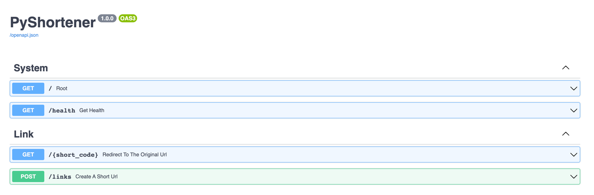

# PyShortener : A shortener URL



## Installation

- [With Docker](docs/installation_with_docker.md)
- [Without Docker](docs/installation_without_docker.md)

## Usage

- (`POST`) Create a link :

```bash
curl -X 'POST' \
  'http://127.0.0.1:8000/links' \
  -H 'accept: application/json' \
  -H 'Content-Type: application/json' \
  -d '{
  "long_url": "https://github.com/chichi13/pyshortener"
}'

# Output :
{
  "short_code": "gd7eQd"
}
```

- (`GET`) Redirect to the original URL :

```bash
curl -X 'GET' \
  'http://127.0.0.1:8000/gd7eQd' \
  -H 'accept: application/json'

# Output :
Redirect 302
```

## Pyshortener environnement variables

Here are all possible environment variables :

`<env_name>: <type> = <default>`

Pydantic configuration :

```python
# Project information
API_V1_STR = ""
APP_VERSION: str = "Unversioned API"
PROJECT_NAME: str | None = "FastAPI app template"

FASTAPI_ENV: AppEnvironment = AppEnvironment.PRODUCTION

# Uvicorn information
UVICORN_HOST: str = "0.0.0.0"
UVICORN_PORT: int = 8000

# CORS
BACKEND_CORS_ORIGINS: List[AnyHttpUrl] = []

# Sentry information
SENTRY_ENABLED: bool | None = False
SENTRY_DSN: str | None = ""
SENTRY_ENV: str | None = "dev"

# Database information
DATABASE_USER: str = "app"
DATABASE_PASSWORD: str = "password"
DATABASE_URL: str = "127.0.0.1"
DATABASE_NAME: str = "app"
DATABASE_PORT: int = 5432
DATABASE_POOL_SIZE: int = 5
DATABASE_MAX_OVERFLOW: int = 10

# Logging
LOGGING_LEVEL: str = "INFO"

# 6 ~= 38 billions short code possibilities
SHORT_CODE_LENGTH: int = 6

# Expiration in days
LINK_EXPIRATION_DELAY: int = 365

# Redis expiration delay
CACHE_EXPIRATION_DELAY: int = 3

# Redis information
REDIS_CONNECTION: bool | None = False
REDIS_URL: str | None = "localhost"
REDIS_PORT: int | None = 6379
REDIS_SOCKET_TIMEOUT: int | None = 3
```
